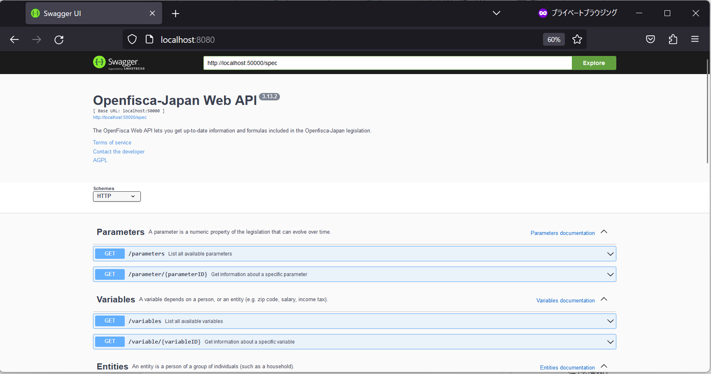
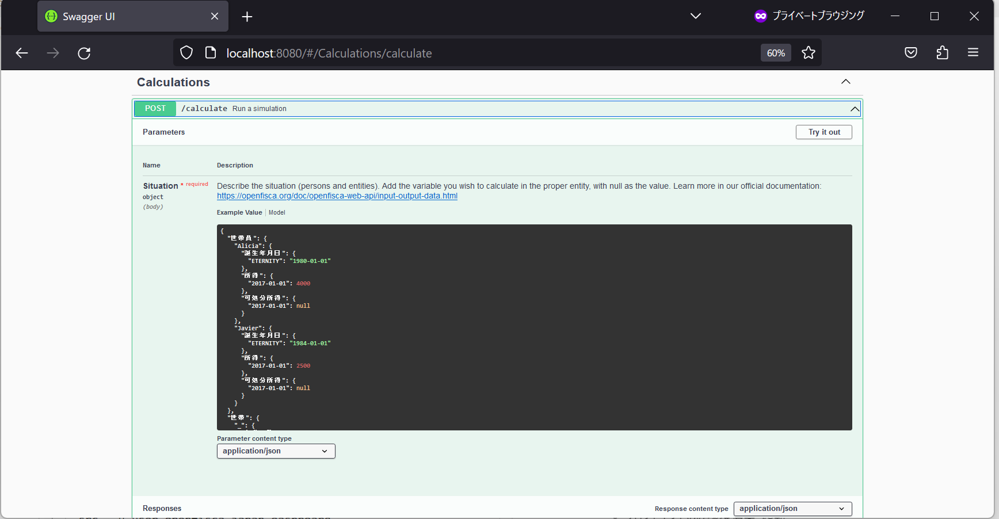
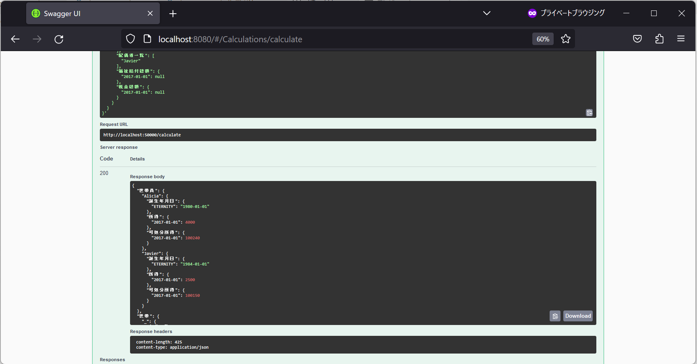

# 開発ドキュメント

## 環境構築

1. Docker Desktopをインストールして起動する。
    - Windowsの場合：[WindowsでのDocker Desktop環境構築](https://chigusa-web.com/blog/windows%E3%81%ABdocker%E3%82%92%E3%82%A4%E3%83%B3%E3%82%B9%E3%83%88%E3%83%BC%E3%83%AB%E3%81%97%E3%81%A6python%E7%92%B0%E5%A2%83%E3%82%92%E6%A7%8B%E7%AF%89/)
    - Macの場合：[MacでのDocker Desktop環境構築](https://matsuand.github.io/docs.docker.jp.onthefly/desktop/mac/install/)

1. proj-inclusiveのOpenFisca-Japan Githubリポジトリをフォークし、ローカル環境（自分のPC）にクローン（ダウンロード）する。 **developブランチ** をチェックアウトする。  
  [フォーク・クローン・プルリクエストの流れ](https://techtechmedia.com/how-to-fork-github/)    
   リポジトリのクローンはGithub desktop, Source treeなどのツールを使うのが簡単です。
1. 自分のPC上にクローンしたOpenfisca-Japanのルートディレクトリで、WindowsならPowershell、MacならTerminalを開く。  
以下の手順でフロントエンド・バックエンドの環境構築・起動を行う。  
環境は同時に複数起動できない。  
そのため、環境を変える場合は元の環境を停止してから新しく起動する。

    - フロントエンド・バックエンドを一括で環境構築・起動  
      ```
      # docker環境を構築・起動
      docker-compose up --build
      # 「Ctrlキー＋c」でdocker環境を停止
      ```

    - バックエンドのみ環境構築・起動  
      ```
      # docker環境を構築
      docker build ./ -t openfisca_japan
      # docker環境を起動
      docker run -it --rm -p 50000:50000 -v "$(pwd):/app" -u user openfisca_japan
      # $(pwd)はDockerfileが存在するディレクトリの絶対パスで置き換える必要があるかもしれません。
      # docker環境を終了
      exit
      ```
  
    - バックエンド(swagger-ui&openfisca)を環境構築・起動
      ```
      # docker環境を構築・起動
      docker compose up -d swagger-ui
      # ブラウザでSwagger-UIを表示する
      http://localhost:8080
      # docker環境を停止・破棄
      docker compose down -v
      ```
      
      Swagger-UIでopenfiscaの動作確認
      
    　
      

    - フロントエンドのみ環境構築・起動  
      ```
      # dashboardのディレクトリに移動
      cd dashboard
      # docker環境を構築
      docker build ./ -t openfisca_japan_dashboard
      # docker環境を起動
      docker run -it --rm -p 30000:30000 -v "$(pwd)/src:/app/src" -u user openfisca_japan_dashboard
      # docker環境を終了
      exit
      # 元のディレクトリに戻る
      cd ..
      ```
    - フロントエンドを起動している場合は
      http://localhost:30000/ をブラウザに打ち込むとフォームが表示されます。

### Dockerを使わない環境構築方法（参考）
#### GitHub Codespaceを使用する方法
Dockerを自分のPCにインストールする必要はありませんが、操作性はやや悪いです。

- このリポジトリ を自分の GitHub アカウントに Fork する or 既に Fork してる場合は Fetch upstream する（必須）
- → Fork した自分のアカウントの側のリポジトリをブラウザで開き、緑色の「Code」ボタンをクリック
- → 「Create codespace on main」をクリック
- → 「Open this codespace in VS Code Desktop」をクリック
- → ダイアログが数回表示されるので全部 OK っぽい方をクリック
- → VSCode と GitHub を連携させるために認証が求められるので承認する
- → VSCode で GitHub Codespaces に無事に接続できたら、動作確認のために、ターミナルで `make` を実行

これだけで全員同じ環境で開発できるようになるはず。料金は 2022-07-02 現在、無料です。

##### このリポジトリを GitHub であなたのアカウントへ Fork して、 `git clone` する

##### Fork したあなたのリポジトリで、GitHub Codespaces を起動して、Visual Studio Code で開く

[](https://gyazo.com/a29c4cce16baca1b33978231849b2269)
[](https://gyazo.com/1351c39a5ac9a4f5a4a4ae9901ec12d6)

##### GitHub Codespaces で動作確認する

```
make
```

##### GitHub Codespaces で API サーバーとして動かす

```
make serve-local
```

- GET http://localhost:50000/spec
- GET http://localhost:50000/entities
- GET http://localhost:50000/variables
- GET http://localhost:50000/parameters


## 開発方法

### バックエンド

#### 事前準備
- バックエンドのdocker環境に入る

#### テスト実行
- 全てのテストを実行（2023/2/25時点でエラーになるため、下の「一部のテストを実行」で確認）
  - `make test` 
- 一部のテストを実行
  - `openfisca test --country-package openfisca_japan openfisca_japan/tests/<実行したいテストファイル或いはディレクトリパス>`
    - 上記コマンド実行時にテストファイル（~.yaml）を読み込みます
    - そのため、テストファイルのみ修正する場合はそれ自身を修正してコマンド実行すれば良いです
#### 内部計算方法の修正
- openfisca_japan/variables/~.py等の計算方法を規定するファイルを修正する
- 以下のコマンドでビルドを行わないとテスト時に修正が反映されない
  - `make build`
- その後、上述のテストを行う
- 通常は標準出力は表示されませんが、例外を発生させると標準出力が表示されデバッグが容易になります

#### テスト条件・結果を記載したCSVファイルから、yamlのテストファイルを自動生成する方法

```
cd make_tests
bash generate.sh
```
  
- 上記コマンドで openfisca_japan/tests/generated 以下にyamlのテストファイルが作成される
  - そのテストファイルを上述の方法でテストする

#### Variableの依存関係を確認する方法

```
python tools/dependency_graph/dependency.py
```

- 上記コマンドで `tools/dependency_graph/dependency_graph.png` にopenfisca_japan全体のVariableの依存関係図が作成される
  - `A -> B` はVariable `A` の計算式に Variable `B` を使用していることを表す
  - 他のVariableに依存していない場合青色で表示される
- 実行には事前に [Graphviz](https://graphviz.org/) のインストールが必要

```
# Ubuntuの場合
sudo apt install graphviz
python -m pip install graphviz
sudo apt install xdg-utils
```


### フロントエンド
- ルートディレクトリで以下コマンドを打ち、フロントエンドとバックエンドのDocker環境を一括で起動する
  - `docker-compose up --build`
- `cd dashboard` でdashboardディレクトリにて開発する。
- http://localhost:30000/ をブラウザに打ち込み、ページを確認する。


## デプロイ方法

### バックエンド（OpenFisca Python APIサーバー）

### 自動build, deploy
- Google CloudのCloud Buildにより、mainブランチ、developブランチにpull (push) されたとき、`Dockerfile_cloud`を元にそれぞれ自動でbuildされ、Cloud Runによりdeployされる。
- mainブランチ、developブランチでbuild, deployされるAPIは別々。`dashboard/src/components/forms/caluculationForm.tsx`の`apiURL`を、mainブランチとdevelopブランチpull (push)時に、`configData.URL.OpenFisca_API.production`と`configData.URL.OpenFisca_API.dev`に手動で切り替えている。

#### ローカルでdockerイメージを作りcloud runにデプロイする（参考）
- `docker build -t gcr.io/openfisca-shibuya/openfisca-shibuya-deploy-test -f Dockerfile_cloud --platform amd64 .`
  - M1 Macの場合、`--platform amd64`が必要
- `docker push gcr.io/openfisca-shibuya/openfisca-shibuya-deploy-test:latest`
  - でGCPのcontainer registoryに保存される
- Cloud Runでアップしたdocker imageを選択してデプロイする
- Makefile内の環境変数は`$hoge`では認識されない。他の記載方法がある？

### フロントエンド
- Netlifyでmainブランチ、developブランチにpull (push)時にbuild, deployされる。

- developブランチのデプロイURLは[https://develop--myseido-simulator.netlify.app/](https://develop--myseido-simulator.netlify.app/)


## TroubleShooting

### Frontend

- When `npm ci` in `dashboard/Dockerfile`, this error happened and docker image can't be made.

  ```
  npm verb cli /usr/local/bin/node /usr/local/bin/npm
  npm info using npm@9.6.7
  npm info using node@v18.17.0
  npm verb cache could not create cache: Error: ENOENT: no such file or directory, mkdir '/home/user/.npm'
  npm verb logfile could not create logs-dir: Error: ENOENT: no such file or directory, mkdir '/home/user/.npm'
  npm verb title npm ci
  npm verb argv "ci" "--loglevel" "verbose"
  npm verb logfile logs-max:10 dir:/home/user/.npm/_logs/2023-07-29T13_01_14_844Z-
  npm verb logfile could not be created: Error: ENOENT: no such file or directory, open '/home/user/.npm/_logs/2023-07-29T13_01_14_844Z-debug-0.log'
  npm verb logfile no logfile created
  npm verb stack Error: ENOENT: no such file or directory, mkdir '/app/node_modules'
  npm verb cwd /app
  npm verb Linux 5.10.104-linuxkit
  npm verb node v18.17.0
  npm verb npm  v9.6.7
  npm ERR! code ENOENT
  npm ERR! syscall mkdir
  npm ERR! path /app/node_modules
  npm ERR! errno -2
  npm ERR! enoent ENOENT: no such file or directory, mkdir '/app/node_modules'
  npm ERR! enoent This is related to npm not being able to find a file.
  npm ERR! enoent 
  npm verb exit -2
  npm verb unfinished npm timer reify 1690635675079
  npm verb unfinished npm timer reify:createSparse 1690635675086
  npm verb code -2

  npm ERR! Log files were not written due to an error writing to the directory: /home/user/.npm/_logs
  npm ERR! You can rerun the command with `--loglevel=verbose` to see the logs in your terminal
  ```

  This error is resolved by add `npm cache clean --force` by root user in Dockerfile.

  The cause is not unknown.   
  It is also unknown whether this error occurs only on the one local PC or in any environment.  
  In Netlify depoloy environment, the error is probably not occured.  
  The error may have happened when the node:18-bullseye docker image went up from 18.16 to 18.17, but same error occured when reversion back to 16. 


### Backend

- (for Windows) 環境変数を利用して Python に UTF-8 を強制させる  
Unicode Decoding Error が起きるときもこちらの通りにしてください。
Powershell を起動し以下のコマンドを入力して下さい。

  ```
  $env:PYTHONUTF8=1
  ```
